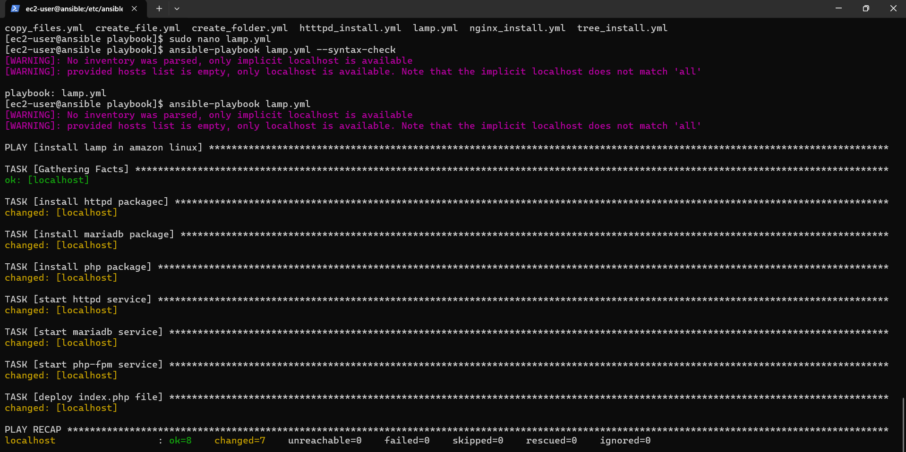
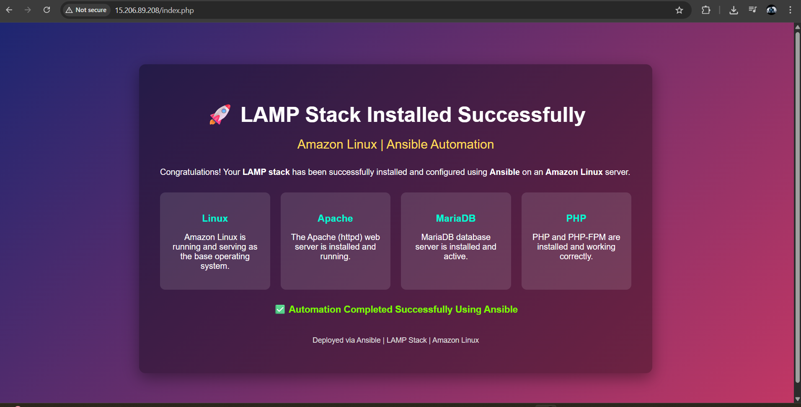

# 🚀 LAMP Stack Installation on Amazon Linux using Ansible

This project demonstrates the automated installation and configuration of a **LAMP stack** on **Amazon Linux** using **Ansible**.  
The setup includes **Apache**, **MariaDB**, **PHP**, and **PHP-FPM**, along with deployment of a custom PHP website to verify the installation.

---

## 📌 Project Overview

Using Ansible playbooks, this project performs the following tasks:

- Installs Apache (`httpd`) web server  
- Installs MariaDB database server  
- Installs PHP and PHP-FPM  
- Starts and enables required services  
- Deploys a custom `index.php` file  
- Installs the `tree` utility using a separate playbook  

---

## 🛠️ Technology Stack

- **OS:** Amazon Linux  
- **Automation:** Ansible  
- **Web Server:** Apache (httpd)  
- **Database:** MariaDB  
- **Scripting:** PHP, PHP-FPM  

---

## 📁 Project Structure

```

ansible-playbooks/
├── lamp.yml
├── tree_install.yml
├── index.php
├── img/
│   ├── lamp-install-success.png
│   └── php-website-output.png
└── README.md

````

---

## 📜 Ansible Playbooks

### 🔹 LAMP Stack Installation (`lamp.yml`)

This playbook installs and configures the complete LAMP stack on Amazon Linux.

Key operations:
- Package installation using `dnf`
- Service management using `systemd_service`
- Website deployment using the `copy` module

---

### 🔹 Tree Utility Installation (`tree_install.yml`)

This playbook installs the `tree` package for directory visualization.

```yaml
- name: Install tree package
  hosts: localhost
  tasks:
    - name: Install tree
      ansible.builtin.dnf:
        name: tree
        state: present
````

---

## ▶️ How to Run the Playbooks

Run the LAMP stack playbook:

```bash
ansible-playbook lamp.yml
```

Run the tree installation playbook:

```bash
ansible-playbook tree_install.yml
```

---

## 🖼️ Screenshots

### LAMP Playbook Execution (Successful)



### PHP Website Output (`index.php`)



---

## ✅ Verification Checklist

* Apache service is running
* PHP page renders successfully in browser
* MariaDB service is active
* PHP-FPM service is enabled and running
* LAMP stack installed fully via Ansible

---

## 🎯 Use Case

This project is useful for:

* Learning Ansible fundamentals
* Automating LAMP stack installation
* Practicing configuration management
* Showcasing DevOps automation projects

---

## 📌 Summary

This project shows how **Ansible** can be used to automate server setup and application deployment in a **repeatable and reliable** way.

Deployed using **Ansible on Amazon Linux**.

---

## 👨‍💻 Author

**Raj Ahire**
AWS | DevOps | Terraform | Ansible | Automation

